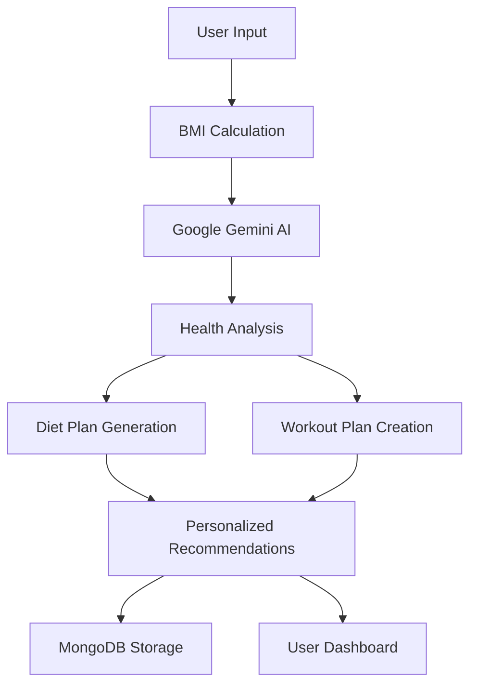

# 🤖💪 AI-Powered BMI Calculator & Health Assistant


## 🎯 Overview

AI-Powered BMI Calculator is an intelligent health assistant that combines traditional BMI calculation with advanced AI capabilities using Google Gemini. The application not only calculates your Body Mass Index but also provides personalized diet plans and workout routines tailored to your specific health goals.

## 🎥 Demo


https://github.com/user-attachments/assets/ba6b4c72-0550-40e8-9dab-8881a4dfbf1d


## Mongo Db Storage


## Mongosh Shell Retrive Data


## ✨ Features

<div align="center">

| 🎯 Feature | 📝 Description |
|------------|----------------|
| **🧮 Smart BMI Calculation** | Accurate BMI computation with health categorization |
| **🤖 AI-Powered Insights** | Google Gemini integration for intelligent recommendations |
| **🥗 Custom Diet Plans** | Personalized nutrition recommendations based on BMI |
| **💪 Workout Routines** | AI-generated exercise plans tailored to fitness goals |
| **📊 Data Persistence** | MongoDB storage for user progress tracking |
| **🌐 Web Interface** | Clean, responsive HTML/CSS frontend |
| **⚡ REST API** | Flask-based API for seamless integration |
| **📱 Mobile Friendly** | Responsive design for all devices |

</div>

---

## 🧠 AI Integration

Our application leverages **Google Gemini AI** to provide intelligent health recommendations:



### 🎯 AI Capabilities

- **📊 Health Assessment**: Comprehensive BMI analysis with health insights
- **🥗 Nutrition Planning**: Custom diet plans based on BMI category and goals  
- **💪 Fitness Coaching**: Personalized workout routines for different fitness levels
- **📈 Progress Tracking**: AI-driven recommendations for continuous improvement
- **🎯 Goal Setting**: Smart goal recommendations based on current health status

---


## 📡 API Endpoints

<details>
<summary><b>🔌 API Documentation</b></summary>

### 🧮 Calculate BMI

**POST** `/api/calculate-bmi`

**Request Body:**
```json
{
  "name": "John Doe",
  "weight": 75,
  "height": 175
}
```

**Response:**
```json
{
  "success": true,
  "data": {
    "name": "John Doe",
    "bmi": 24.49,
    "category": "Normal weight",
    "diet_plan": {
      "breakfast": "Oatmeal with fruits and nuts",
      "lunch": "Grilled chicken salad with mixed vegetables",
      "dinner": "Baked salmon with quinoa and steamed broccoli",
      "snacks": ["Greek yogurt", "Mixed nuts", "Fresh fruit"]
    },
    "workout_plan": {
      "cardio": "30 minutes moderate-intensity cardio, 3-4 times per week",
      "strength": "2-3 strength training sessions per week",
      "flexibility": "Daily stretching or yoga for 10-15 minutes"
    },
    "health_tips": [
      "Maintain current weight through balanced diet",
      "Stay hydrated with 8-10 glasses of water daily",
      "Get 7-9 hours of quality sleep"
    ]
  },
  "timestamp": "2024-01-15T10:30:00Z"
}
```

### 📊 Get All BMI Records

**GET** `/api/all-records`

**Response:**
```json
{
  "success": true,
  "count": 25,
  "records": [
    {
      "name": "John Doe",
      "bmi": 24.49,
      "category": "Normal weight",
      "timestamp": "2024-01-15T10:30:00Z"
    }
  ]
}
```

### 🔍 Get User Records

**GET** `/api/user/{name}`

**Response:**
```json
{
  "success": true,
  "user": "John Doe",
  "records": [
    {
      "bmi": 24.49,
      "weight": 75,
      "height": 175,
      "timestamp": "2024-01-15T10:30:00Z"
    }
  ]
}
```

</details>

---

## 🏗️ Project Structure

```
├── .gitignore
├── All_BMIS.html
├── BMI_Program.py
├── BMI_Service.py
└── Web_Interface.html
```

### 🗂️ File Descriptions

| File | Purpose | Key Functions |
|------|---------|---------------|
| `BMI_Program.py` | Main Flask app | Route handling, API endpoints |
| `BMI_Service.py` | Core logic | BMI calculation, AI integration, DB operations |
| `Web_Interface.html` | User interface | Input form, responsive design |
| `All_BMIS.html` | Records display | Show all BMI calculations |

---

## 🛠️ Technologies

<div align="center">


</div>

---

## 📊 Data Storage

### MongoDB Schema

```javascript
    {
        "name": "John Wick",
        "weight": 72.0,
        "height": 1.9,
        "bmi": 19.94,
        "bmi_status": "Underweight",
        "diet_suggestion": "Increase calorie intake with nutrient-rich foods.",
        "workout_suggestion": "Focus on strength training to build muscle mass."
    }
```

### 🏷️ BMI Categories

| BMI Range | Category | Health Status | Color Code |
|-----------|----------|---------------|------------|
| < 18.5 | Underweight | ⚠️ Below normal | 🔵 Blue |
| 18.5 - 24.9 | Normal | ✅ Healthy | 🟢 Green |
| 25.0 - 29.9 | Overweight | ⚠️ Above normal | 🟡 Yellow |
| ≥ 30.0 | Obese | ⚠️ High risk | 🔴 Red |

---

## 🐛 Issues & Support

Need help or found a bug?

- **🐛 Report Bugs**: [Create Issue](https://github.com/ARONAGENT/ai-bmi-calculator/issues/new?template=bug_report.md)
- **💡 Feature Requests**: [Request Feature](https://github.com/ARONAGENT/ai-bmi-calculator/issues/new?template=feature_request.md)
- **❓ Questions**: [GitHub Discussions](https://github.com/ARONAGENT/ai-bmi-calculator/discussions)
- **📧 Direct Contact**: [rohanuke1@gmail.com](mailto:rohanuke1@gmail.com)

---

## 📈 Roadmap

<details>
<summary><b>🗺️ Future Development Plans</b></summary>

### Version 2.0 (Coming Soon)

- [ ] **🔐 User Authentication**: Secure login and personalized dashboards
- [ ] **📊 Advanced Analytics**: Detailed health trend analysis
- [ ] **🍎 Nutrition Tracking**: Calorie and macro tracking integration
- [ ] **🏃‍♂️ Activity Monitoring**: Fitness tracker integration
- [ ] **🩺 Health Metrics**: Blood pressure, heart rate monitoring
- [ ] **👥 Social Features**: Share progress with friends and family

### Version 3.0 (Future)

- [ ] **🤖 Advanced AI**: Multiple AI model integration
- [ ] **📱 Mobile App**: Native iOS and Android applications
- [ ] **🌍 Multi-language**: Support for 10+ languages
- [ ] **🩺 Medical Integration**: Healthcare provider connectivity
- [ ] **🎯 AI Coach**: 24/7 personalized health coaching

</details>

---

## 📄 License
```
Copyright (c) 2024 ARONAGENT

Permission is hereby granted, free of charge, to any person obtaining a copy
of this software and associated documentation files (the "Software")...
```

---

## 🙏 Acknowledgments

- **🤖 Google AI Team**: For the amazing Gemini API
- **🍃 MongoDB Team**: For robust database solutions
- **🌶️ Flask Community**: For the lightweight web framework
- **👥 Contributors**: All developers who helped improve this project
- **🩺 Health Experts**: For guidance on safe BMI calculations

### 🎯 **"Your AI-Powered Path to Better Health"**

**Built with ❤️ by [ARONAGENT](https://github.com/ARONAGENT)**

